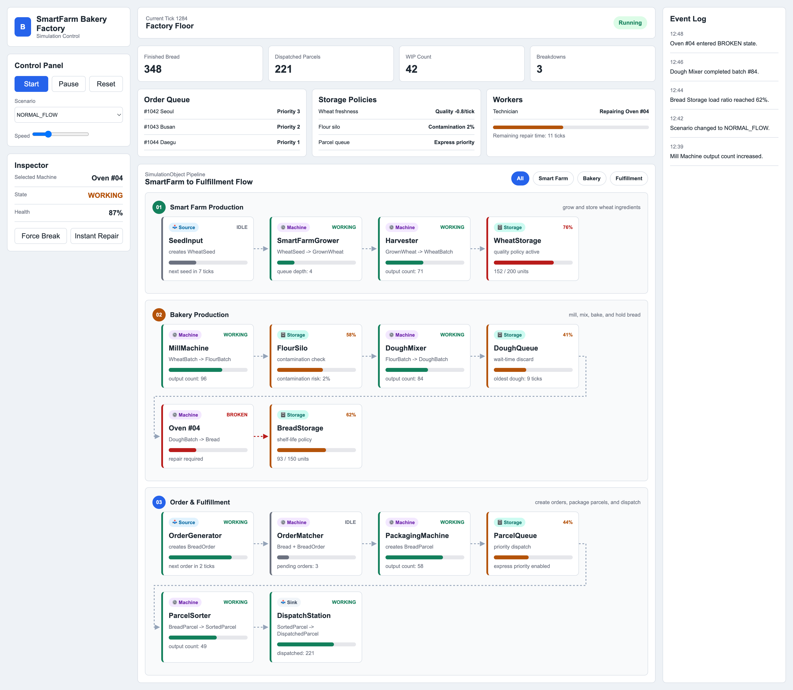
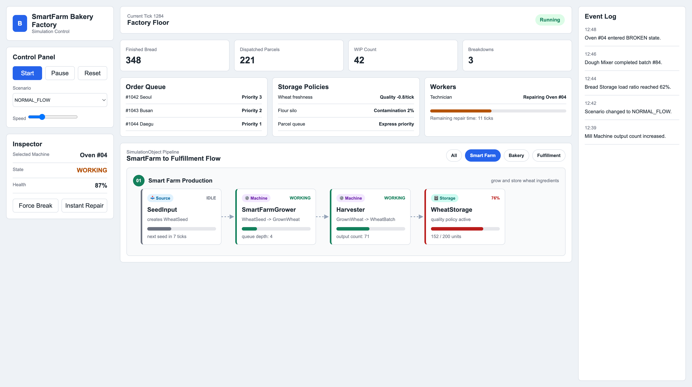
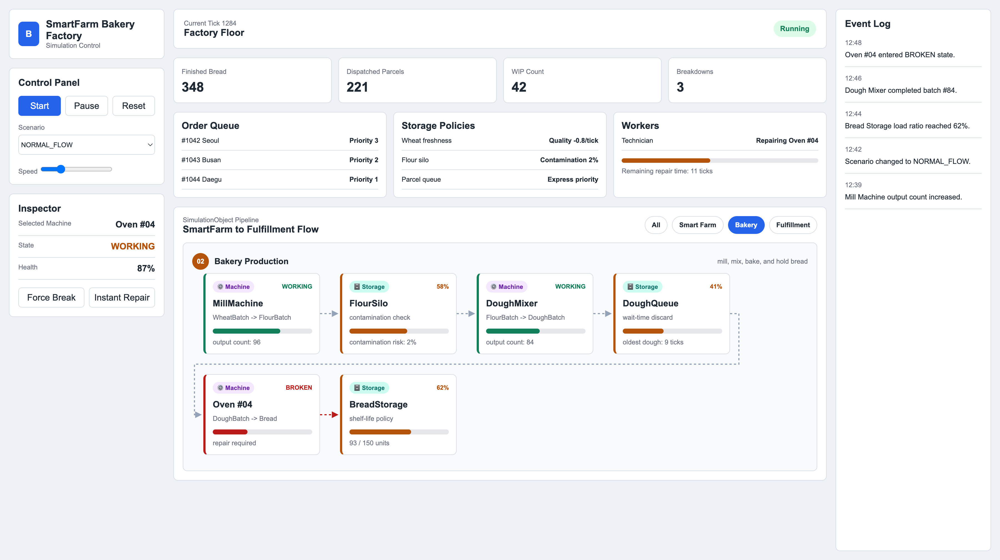
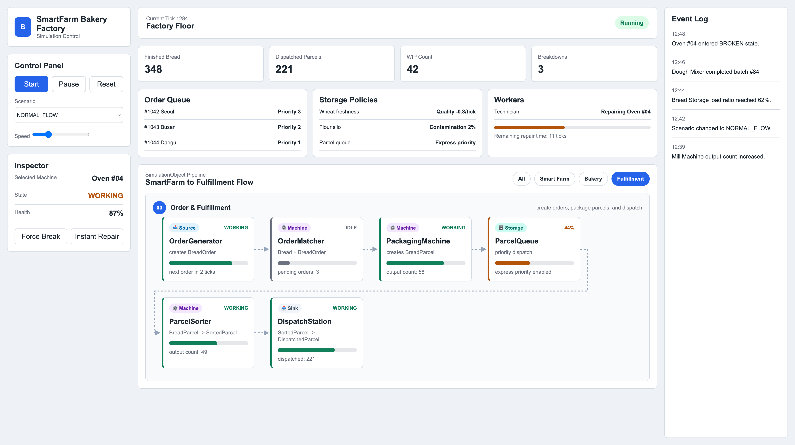

# BBANG - Smart Farm Bakery Simulation

## UML Class Diagram

---

## UI Screenshots (Dear ImGui)

### 1. Main Dashboard

> Main dashboard overview displaying the complete Smart Farm Bakery pipeline, control panel, and real-time event log.

### 2. Smart Farm Production

> Smart Farm production view, monitoring the initial agricultural process from seed input to wheat storage.

### 3. Bakery Production

> Bakery production view, illustrating color-coded machine states such as the BROKEN status of the oven.

### 4. Order & Fulfillment

> Order and fulfillment view, detailing order matching, packaging, and final dispatch metrics.
