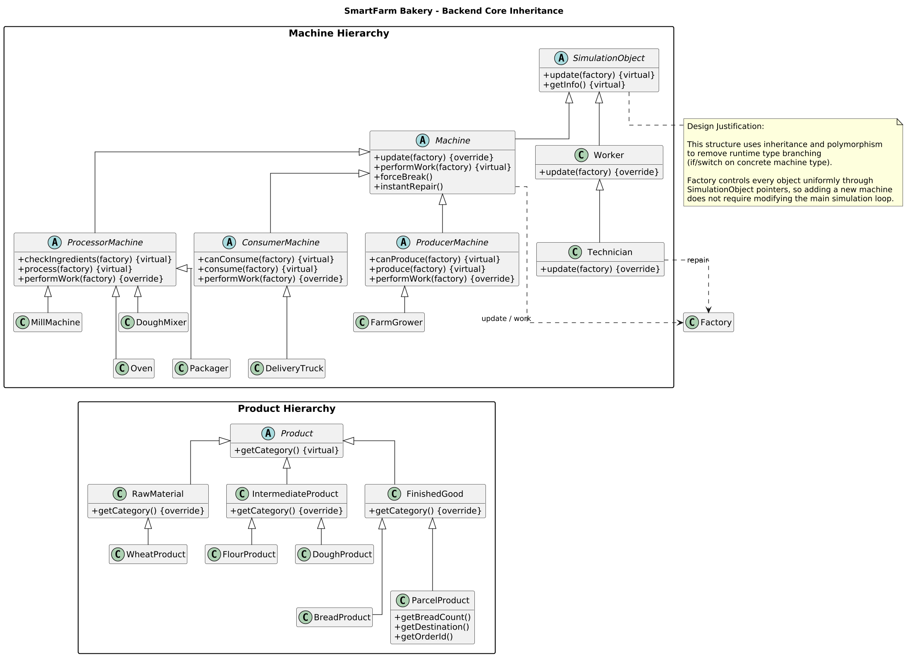
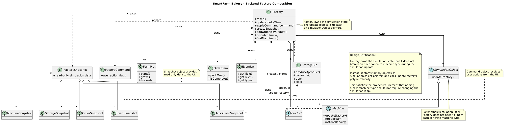
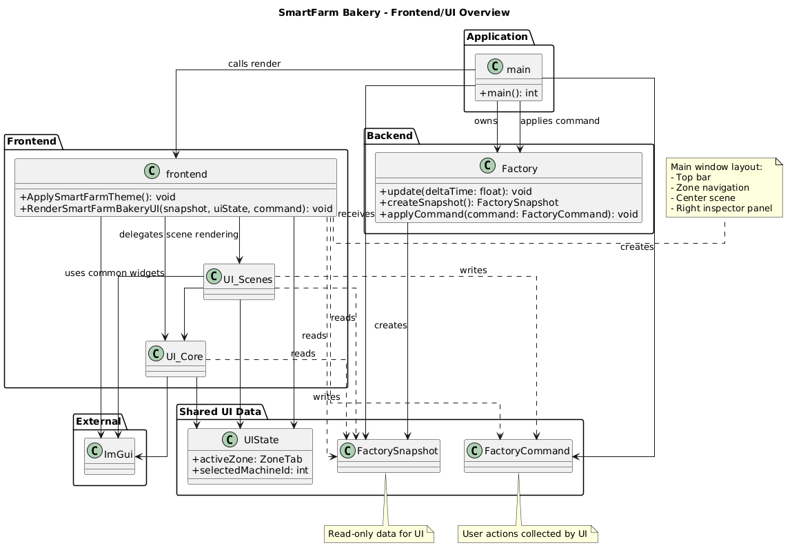
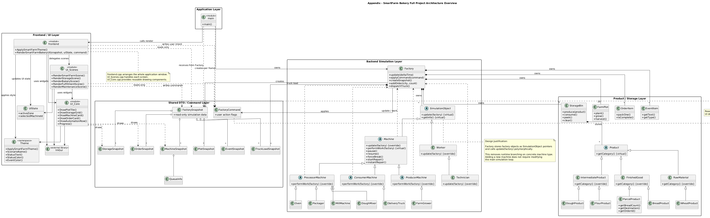

# BBANG - Smart Farm Bakery Simulation

## UML Class Diagram

#1. Backend Core Inheritance

A class hierarchy of machines and products that achieves perfect polymorphism by utilizing SimulationObject as the base class, completely eliminating runtime type branching (if/switch statements).

#2. Backend Factory Composition

An architectural view illustrating how the Factory core centrally manages the simulation state and owned data, while generating read-only Snapshot and write-only Command objects to communicate with the UI.

#3. Frontend/UI Overview

A modular rendering architecture completely isolated from the business logic, utilizing ImGui and reusable components (UI_Core) to visualize simulation data and capture user commands.

#4. Full Project Overview

A comprehensive blueprint of the system demonstrating loose coupling between the application (main), frontend, backend, and data layers via Data Transfer Objects (DTOs) without direct dependencies.

## Simulation

#1. Auto

#2. Auto

